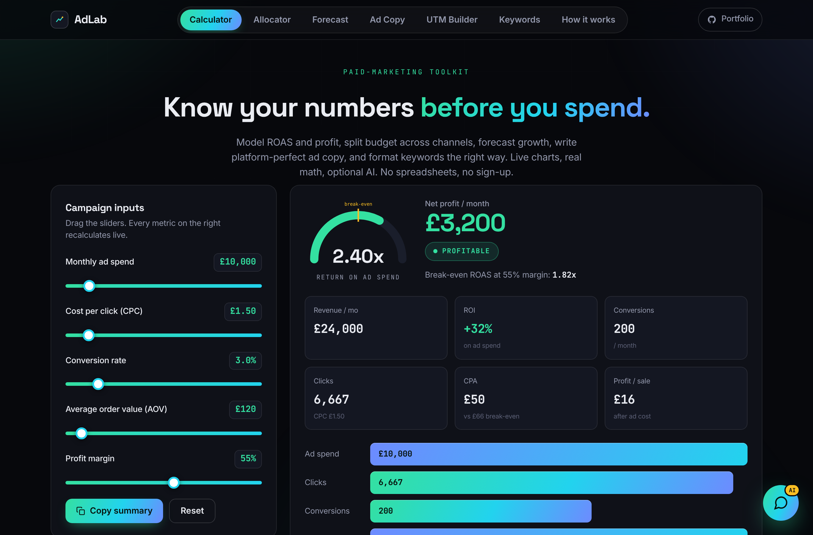
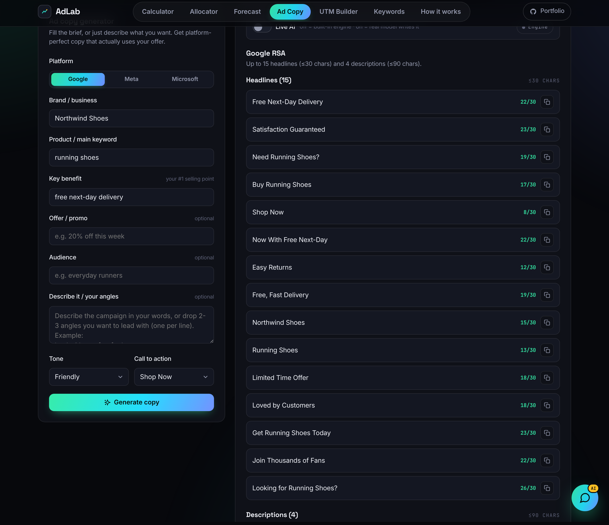
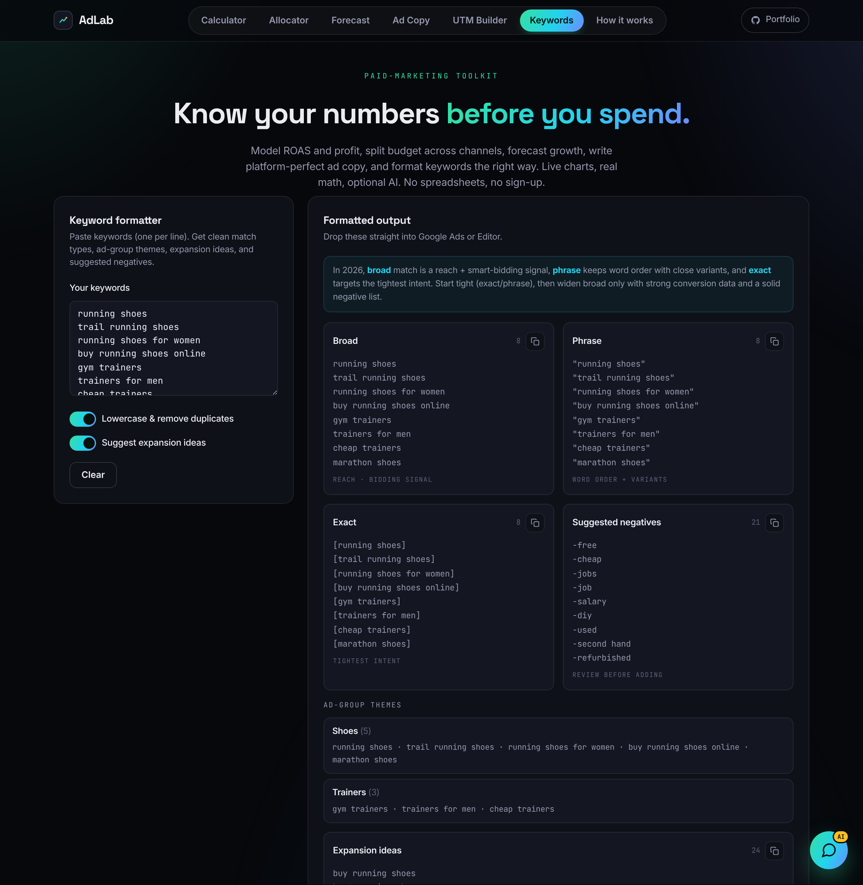
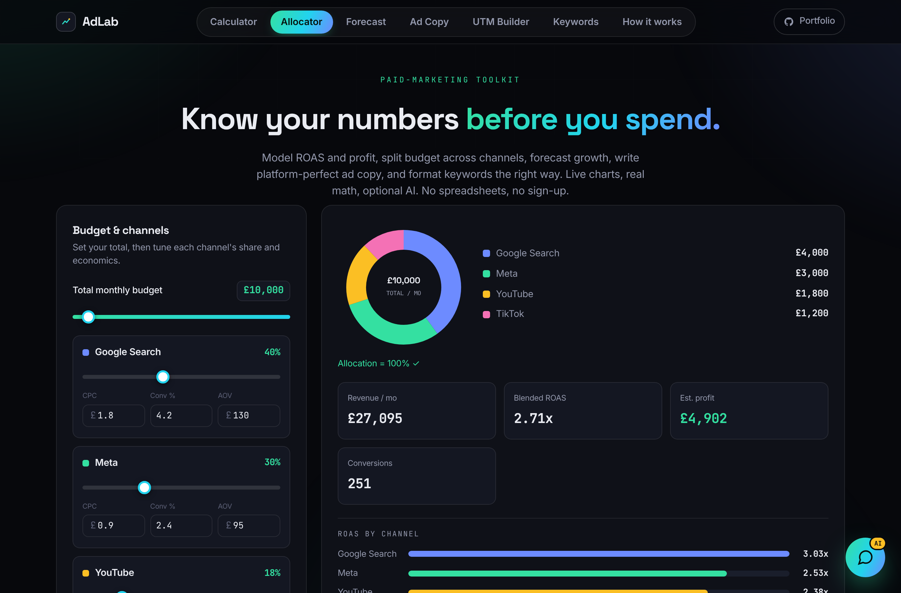
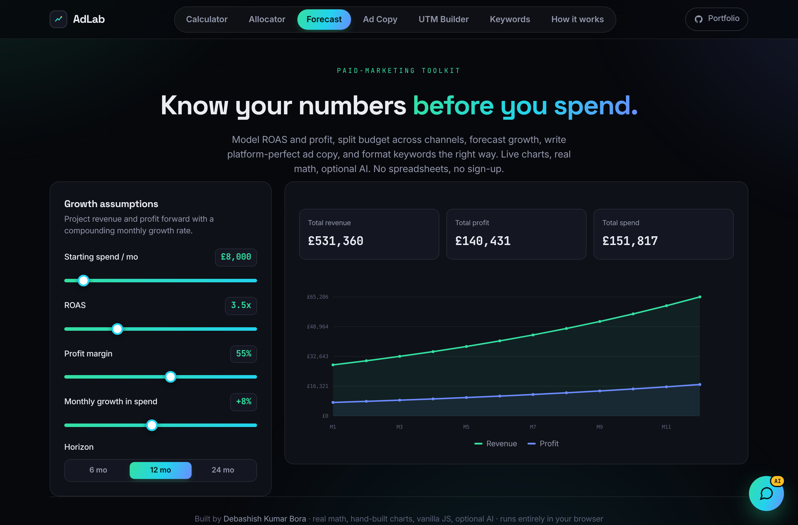
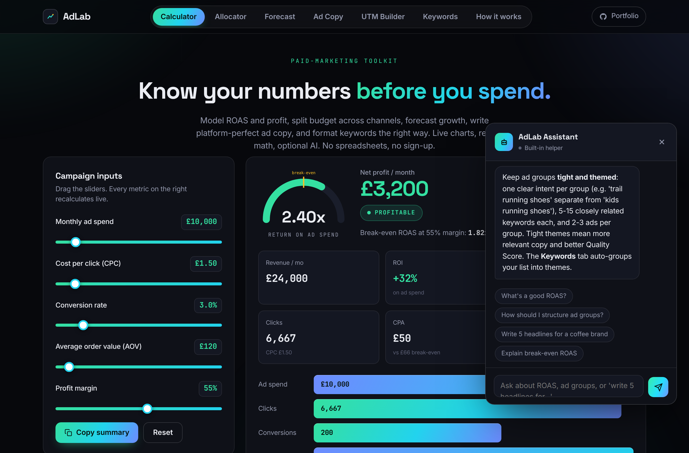

# AdLab — Paid-Marketing Toolkit

A free, single-file, in-browser suite of six paid-marketing tools, with a real ad-copy engine, optional **Live AI**, and a built-in **chatbot**. No backend, no sign-up, no API keys in the code. It runs entirely in the browser.

> Built by [Debashish Kumar Bora](https://debashishkumarbora.github.io).

**Live demo:** https://debashishkumarbora.github.io/adlab/

---

## Screenshots

### ROI Calculator
Model ROAS, profit and break-even live, with a custom gauge and conversion funnel.

### Ad Copy generator
Fill the brief or just describe the campaign. Get platform-perfect headlines and descriptions that actually use your benefit and offer, fitted to each platform's exact character limits.

### Keyword formatter
Clean match types plus ad-group themes, expansion ideas and a suggested negatives list.

### Budget Allocator
Split spend across channels and see the blended ROAS, with a live donut and per-channel bars.

### Forecast
Project revenue and profit forward with a compounding growth model and a hand-built line chart.

### AdLab Assistant (chatbot)
A built-in marketing assistant that answers questions and writes copy, with optional Live AI.

---

## Six tools in one
1. **ROI Calculator** — spend, CPC, CVR, AOV and margin into ROAS, ROI, CPA, net profit and break-even, with a live gauge, funnel and insights.
2. **Budget Allocator** — split budget across Google, Meta, YouTube and TikTok, with a live donut, per-channel ROAS bars and an Auto-optimise button.
3. **Forecast** — compounding growth model with an interactive revenue and profit chart over 6, 12 or 24 months.
4. **Ad Copy generator** — angle-based engine that uses your brand, keyword, benefit, offer and audience, plus a free-text idea box. Specs enforced for Google and Microsoft RSA (15 headlines, 4 descriptions) and Meta. Per-line character validation, copy, copy-all and CSV export.
5. **UTM Builder** — trackable campaign URLs with live preview and one-click copy.
6. **Keyword Formatter** — Broad, Phrase, Exact done right, plus ad-group themes, expansion ideas and suggested negatives.

Plus a **How it works** page that shows every formula and ad spec transparently.

## Live AI (free, honest)
- Default is the built-in engine. It works for everyone with zero setup.
- Toggle **Live AI** and a real model writes the copy and powers the chatbot.
  - In the Claude preview it runs live for free.
  - On the deployed site, paste a free **Google Gemini** key ([aistudio.google.com/apikey](https://aistudio.google.com/apikey)). The key stays in the browser tab and is sent only to Google. No key ever costs anything.
  - No key, no problem. The engine still produces real, usable copy.

## Deploy (free, GitHub Pages)
1. Create a public repo named `adlab`.
2. Upload `index.html`, `README.md` and the `screenshots` folder.
3. **Settings → Pages → Source:** `main` / `root` → **Save**.
4. Live in about a minute at the URL above. Check it in an **Incognito** window (GitHub Pages caches hard).

## Tech
`HTML` · `CSS` · vanilla `JavaScript` · hand-rolled `SVG` charts · Anthropic / Gemini for optional Live AI. Single file, no frameworks, no build step.
